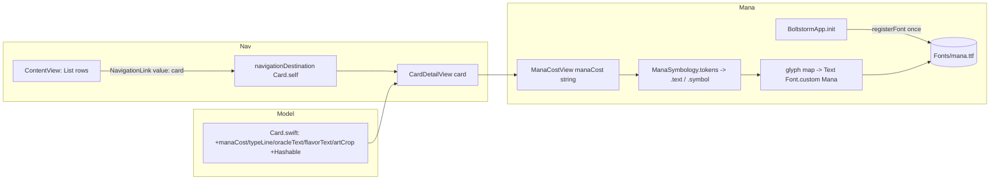

# MTG Card Detail Screen — Implementation Plan

## Context

Boltstorm lets a user search Scryfall and see a flat `List` of results
(`ContentView` → `CardRow` at `Boltstorm/ContentView.swift:15`), but tapping a
row does nothing. We want a scrollable **card detail screen** showing, top to
bottom: card art, a name + mana-cost header, type line, oracle text, and
(conditional) flavor text — laid out like the Scryfall web detail view.

Two gaps block this today: the `Card` model
(`Boltstorm/Card.swift`) only decodes `id`, `name`, and image URLs, and there is
no way to navigate from the list. So we (1) expand the model, (2) render mana
symbols inline via a bundled icon font, and (3) wire navigation.

### Decisions (locked with the user, confirmed against the codebase)
- **Mana symbols:** render via the bundled **"Mana" icon font** (Andrew Gioia,
  SIL OFL) — no Swift package, no symbology network fetch. A static
  tag→glyph map turns `{R}`/`{2}`/… into Mana-font glyphs rendered as `Text`.
- **Data source:** navigate by **passing the already-fetched `Card`** — Scryfall
  search already returns full card objects, so no extra fetch is needed.
- **Navigation:** wire search rows to tap into the detail screen.
- **SwiftData is not used** today (the CLAUDE.md note is aspirational — confirmed:
  `BoltstormApp.swift` has no `ModelContainer`). This feature needs no persistence.

### Verified during planning (de-risks the draft)
- The project uses `PBXFileSystemSynchronizedRootGroup`, so **new files placed in
  `Boltstorm/` — including the `.ttf` — are bundled automatically**; no `.pbxproj` edits.
- `GENERATE_INFOPLIST_FILE = YES` (no editable `Info.plist`) → register the font
  **at runtime** with `CTFontManagerRegisterFontsForURL`, not `UIAppFonts`.
- `mana.ttf` downloads cleanly in this environment (408 KB). Its family **and**
  PostScript name are both exactly **`Mana`** → use `Font.custom("Mana", size:)`.
  The implementer can `curl` it directly into the repo — **no manual user step.**
- **Correction to the draft:** hybrid (`{W/U}`) and Phyrexian (`{W/P}`) symbols
  have **no single glyph** in this font (they're CSS composites). They will fall
  back to readable text, not map to a glyph. The single-glyph set we map is the
  colors, generic numbers, and the standalone symbols listed in Step 3.

## Shape of the change

## Files

### New
- `Boltstorm/CardDetailView.swift` — the screen.
- `Boltstorm/ManaSymbology.swift` — tag→glyph map, `{…}` tokenizer, font registration.
- `Boltstorm/ManaCostView.swift` — renders a mana-cost string as inline glyphs.
- `Boltstorm/Fonts/mana.ttf` — bundled Mana font (fetched into the repo, committed).
- `BoltstormTests/CardDecodingTests.swift` — new-field decoding + DFC fallback.
- `BoltstormTests/ManaSymbologyTests.swift` — tokenizer + glyph mapping.

### Modified
- `Boltstorm/Card.swift` — add detail fields + `Hashable`.
- `Boltstorm/ContentView.swift` — `NavigationLink` rows + `.navigationDestination`.
- `Boltstorm/BoltstormApp.swift` — register the Mana font once at launch.

## Step 1 — Bundle & register the Mana font
- Fetch the font into the repo:
  `curl -sL -o Boltstorm/Fonts/mana.ttf https://raw.githubusercontent.com/andrewgioia/mana/master/fonts/mana.ttf`
  (verified reachable + valid TTF during planning).
- In `ManaSymbology`, add `registerFont()` that locates `mana.ttf` via
  `Bundle.main.url(forResource: "mana", withExtension: "ttf")` and calls
  `CTFontManagerRegisterFontsForURL(url, .process, nil)`. Guard against
  double-registration (ignore the "already registered" error). Call it once from
  `BoltstormApp.init()`.

## Step 2 — Expand the `Card` model (`Boltstorm/Card.swift`)
- Add **optional** stored fields (so the current minimal search JSON and existing
  tests still decode): `manaCost` (`mana_cost`), `typeLine` (`type_line`),
  `oracleText` (`oracle_text`), `flavorText` (`flavor_text`). Add the matching
  `CodingKeys` cases.
- Extend the private `ImageUris` struct with `artCrop` (`art_crop`), optional.
  Make `small` optional too if needed for safety, but it is currently non-optional
  and tests rely on it — keep `small` as-is and add `artCrop: String?`.
- Add `artCropURL: URL?` mirroring the existing `thumbnailURL` idiom
  (`Boltstorm/Card.swift:14`): top-level `imageUris?.artCrop` first, then
  `cardFaces?.first?.imageUris?.artCrop`.
- Extend the private `CardFace` struct with optional `manaCost` / `typeLine` /
  `oracleText` / `flavorText` (+ CodingKeys), so DFC fallback can read them.
- For each new text field add a computed accessor that falls back to
  `cardFaces?.first?...` when the top-level value is nil — same fallback idiom
  already used for images. (Either expose computed `var`s and keep the stored
  decoded values private, or decode into private stored props and expose merged
  computeds; pick whichever reads cleanest alongside `thumbnailURL`.)
- Add `Hashable` conformance based **solely on `id`** (manual `==` + `hash(into:)`),
  so value-based `.navigationDestination(for: Card.self)` works without making the
  private nested structs `Hashable`.

## Step 3 — Symbol map + tokenizer (`Boltstorm/ManaSymbology.swift`)
Dependency-free, mostly static, no networking.
- `registerFont()` (Step 1).
- A static `[String: Character]` from Scryfall tag (without braces, uppercased) to
  a Mana-font glyph. Codepoints verified from the Mana project's `mana.css`:

  | Scryfall tag | Mana class | code point |
  |---|---|---|
  | `W U B R G` | `ms-w/u/b/r/g` | U+E600..E604 |
  | `0`–`20` | `ms-0`…`ms-20` | U+E605..E614 (0–15), then 16=E62A,17=E62B,18=E62C,19=E62D,20=E62E |
  | `X Y Z` | `ms-x/y/z` | U+E615 / E616 / E617 |
  | `C` (colorless) | `ms-c` | U+E904 |
  | `S` (snow) | `ms-s` | U+E619 |
  | `T` (tap) | `ms-tap` | U+E61A |
  | `Q` (untap) | `ms-untap` | U+E61B |
  | `P` (Phyrexian generic) | `ms-p` | U+E618 |

  Build the `Character` from the scalar, e.g. `Character(UnicodeScalar(0xE603)!)`.
- **Unknown / composite tags fall back to raw text.** This deliberately covers
  hybrids (`{W/U}`) and Phyrexian (`{W/P}`): they have no single glyph in this
  font, so they render as their inner text (`W/U`, `W/P`) instead of disappearing.
- Pure tokenizer `tokens(in:) -> [Token]` where
  `enum Token { case text(String); case symbol(String) }`, splitting on `{...}`
  groups by scanning for matched braces. An unclosed `{` is emitted as plain text.
  Pure and trivially unit-testable; reused by `ManaCostView`.

## Step 4 — `ManaCostView` (`Boltstorm/ManaCostView.swift`)
- Input: a mana-cost string (e.g. `"{2}{R}{R}"`). Tokenize via `ManaSymbology`,
  lay out in an `HStack` (used right-aligned in the header).
- Known symbol → `Text(String(glyph)).font(.custom("Mana", size:))` sized to the
  adjacent line; unknown/`.text` → fall back to the raw text.
- Build a spoken description (e.g. "two generic, red, red") for
  `.accessibilityLabel`; mark individual glyphs `.accessibilityHidden(true)`.

## Step 5 — `CardDetailView` (`Boltstorm/CardDetailView.swift`)
`init(card: Card)`. Vertical `ScrollView`, in this exact order:
1. **Art (top, ≤ ¼ screen):** full-bleed `art_crop`. Cap height at ~25% of screen
   height (`GeometryReader` or `UIScreen` height); `.frame(maxWidth: .infinity)`,
   `scaledToFill()` + `.clipped()`.
   - Define `enum ImageLoadingStatus { case loading, success, failed }` and a
     `CardArtView` mapping `AsyncImage` phases to it. **Failure →** gray
     placeholder block + SF Symbol `exclamationmark.triangle`, reusing the
     `RoundedRectangle(...).fill(Color.secondary.opacity(0.2))` placeholder idiom
     from `CardRow` (`Boltstorm/ContentView.swift:45`).
2. **Header row:** `Text(card.name)` left, `ManaCostView` right (`HStack` + `Spacer`).
3. `Divider()`.
4. **Type line:** `Text(card.typeLine ?? "")`.
5. `Divider()`.
6. **Oracle text:** `Text(card.oracleText ?? "")`, body style, multi-line.
7. **Flavor text:** only if non-nil/non-empty — `.italic()`, `.secondary`. Wrap in
   `if let` so the block **and its spacing collapse entirely** when absent.
- `.accessibilityElement(children: .combine)` on the name/type/oracle blocks.
- HIG: standard padding, `.font` text styles (Dynamic Type), `Divider()` rules.
- Add a `#Preview` with a sample `Card` (with flavor) and a no-flavor variant. Since
  `Card` has only a `Decodable` init, build preview/test instances by decoding a
  small JSON literal with `JSONDecoder` (no public memberwise init needed).

## Step 6 — Wire navigation (`Boltstorm/ContentView.swift`)
- Wrap each row: `NavigationLink(value: card) { CardRow(card: card) }`.
- Add `.navigationDestination(for: Card.self) { CardDetailView(card: $0) }` on the
  `NavigationStack`.

## Step 7 — Tests
- **CardDecodingTests** (`BoltstormTests/CardDecodingTests.swift`): decode `Card`
  directly with `JSONDecoder().decode(Card.self, from:)` — **no `MockURLProtocol`
  needed** (decoding is offline; simpler than the network harness). Cover:
  full card JSON decodes `mana_cost`/`type_line`/`oracle_text`/`flavor_text`/
  `art_crop`; missing `flavor_text` → `nil`; a DFC card pulls oracle/mana/type from
  `card_faces.first`; the existing minimal search JSON still decodes (regression).
- **ManaSymbologyTests** (`BoltstormTests/ManaSymbologyTests.swift`): tokenizer
  splits `"{2}{R} deal damage"` into the expected `.symbol`/`.text` sequence;
  handles empty, no-symbol, and unclosed-brace (`"{R"`) strings; glyph map returns
  a glyph for `{R}`/`{T}`/`{2}` and falls back (no glyph) for unknown `{W/U}` and `{FOO}`.

(Font glyph rendering and SwiftUI layout aren't unit-tested — covered by previews
and the manual run.)

## Verification
1. **Build:** `xcodebuild -project Boltstorm.xcodeproj -scheme Boltstorm -destination 'platform=iOS Simulator,name=iPhone 16' build`
2. **Unit tests:** same command with `test`.
3. **Manual run** (simulator): search "Lightning Bolt" → tap the row → confirm:
   - art crop fills the top ≤¼ of the screen; with network killed, the gray +
     `exclamationmark.triangle` placeholder shows;
   - name (left) + `{R}` mana glyph (right) render in the Mana font; dividers,
     type line, oracle text appear in order;
   - a card with flavor shows italic flavor; one without shows no gap;
   - VoiceOver reads name/type/oracle as continuous strings.
4. **Previews:** `CardDetailView` previews (with/without flavor) render in canvas.

## Open risks (residual)
- **Font copy into bundle:** confirm the synchronized group actually copies
  `Boltstorm/Fonts/mana.ttf` into the app bundle (verify `registerFont()` succeeds
  in the simulator run). If the nested `Fonts/` folder isn't picked up, place
  `mana.ttf` directly in `Boltstorm/`.
- **Glyph coverage:** the static map covers colors, generic numbers, and the
  standalone symbols above; hybrids/Phyrexian and any unmapped tag fall back to
  raw text rather than breaking layout.
